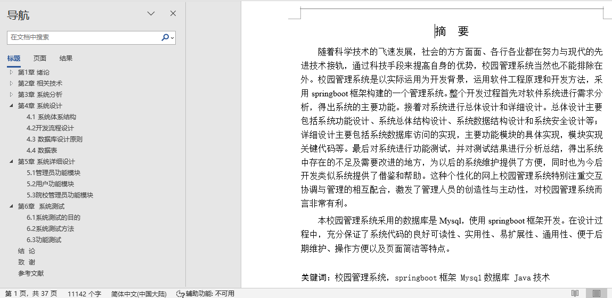

## 校园管理系统(程序+报告)

###  获取sql数据库文件: 从戎源码网 (https://armycodes.com/) QQ: 386869957 QQ群: 377586148
###  所有系统地址: (https://github.com/YuLin-Coder/AllProjectCatalog) 
###  所有项目以及源代码本人均调试运行无问题 可支持远程安装部署调试、定制修改、代码讲解

## 项目介绍
校园管理系统，系统包含两种角色：用户、管理员，系统分为前台和后台两大模块，主要功能如下：

管理员功能模块
管理员登录: 管理员通过用户名、密码、角色登录系统。
院校管理: 管理学院名称、简介、职工人数、院校账号等信息，进行详情查看、修改、删除操作。
用户管理: 查看、修改、删除用户信息。
单位类别管理: 管理单位类别信息，进行详情查看、修改、删除操作。
院校管理员管理: 管理院校管理员的账号、姓名、性别、联系方式等信息。
单位管理: 管理单位信息，包括姓名、性别、年龄、照片等，进行详情查看、绑定用户、修改、删除操作。
通知推送管理: 管理通知内容、发送时间等信息，进行详情查看、修改、删除操作。
投票信息管理: 管理候选人信息及投票情况，进行详情查看、修改、删除操作。
通知回复管理: 管理回复内容及时间，进行详情查看、修改、删除操作。

用户功能模块
用户登录: 用户通过用户名、密码登录系统。
个人信息: 查看和修改个人信息，如姓名、性别、照片、联系方式等。
单位管理: 查看单位信息，进行详情查看等操作。
通知推送管理: 查看和管理通知内容。
投票信息管理: 查看投票信息，进行详情查看等操作。

院校管理员功能模块
个人信息: 查看和修改个人信息，如院校账号、负责人姓名、联系方式等。
用户管理: 管理用户账号、姓名、性别、联系方式等信息，进行详情查看、修改、删除操作。
单位类别管理: 查看和管理单位类别信息，进行详情查看、修改、删除操作。
通知推送管理: 管理通知内容和发送时间，进行详情查看、回复操作。
通知回复管理: 查看和管理回复内容及时间，进行详情查看、修改、删除操作。

## 项目技术
- 编程语言：Java
- 数据库：MySQL
- 项目管理工具：Maven
- 前端技术：HTML、CSS、JavaScript、Vue
- 后端技术：Spring、SpringMVC、MyBatis

## 运行环境
- JDK版本：JDK1.8及以上
- 开发工具：IDEA、Ecplise、Myecplise都可以
- 数据库: MySQL5.7及以上
- Maven：maven3.0及以上
- Node：14.14.0及以上

## 运行截图

